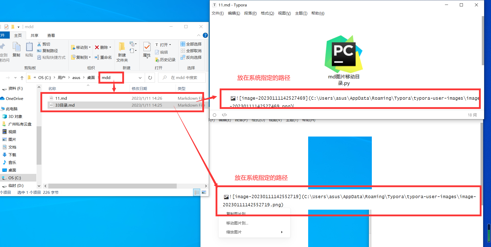
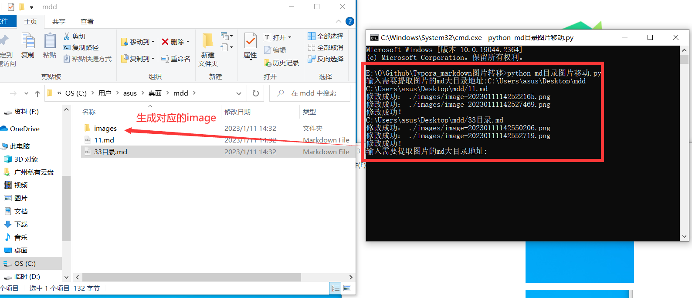
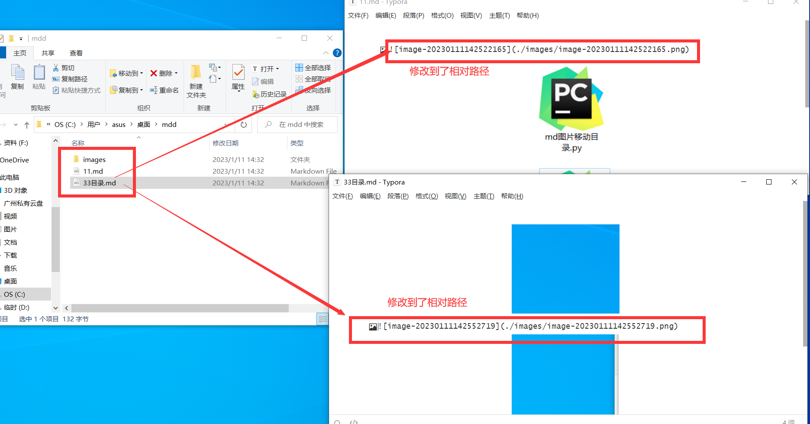
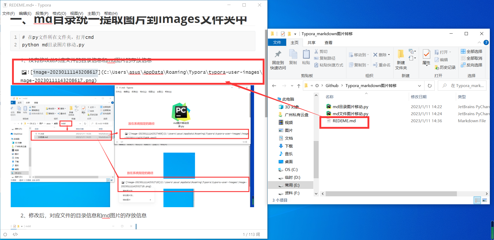
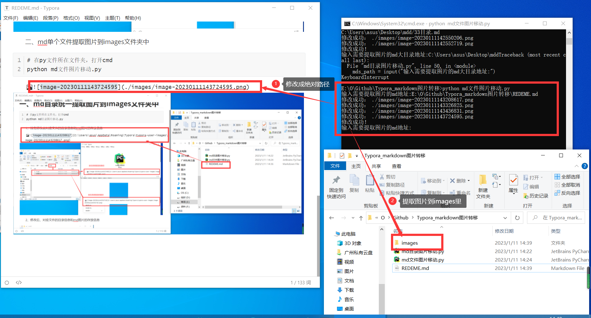

## 一、介绍

**相对于第一个版本改进：**添加了网页图片下载和修改md文件的功能。

**主要功能：** 可以根据单个md文件地址或者md目录文件的地址，批量提取md里面图片的地址，并且把md图片对应的地址修改成提取图片对应的位置。

**格式：** 会在md文件同目录下建立一个images文件夹，用来存放系统转移过来的文件。

## 二、md目录统一提取图片到images文件夹中

```she
# 在py文件所在文件夹，打开cmd
python md目录图片移动v2.0
```

**1、没有修改前对应文件的目录信息和md图片的存放信息**



**2、修改后，对应文件的目录信息和md图片的存放信息**





## 三、md单个文件提取图片到images文件夹中

```she
# 在py文件所在文件夹，打开cmd
python md文件图片移动v2.0
```

**1、没有修改前对应文件的目录信息和md图片的存放信息**



**2、修改后，对应文件的目录信息和md图片的存放信息**



