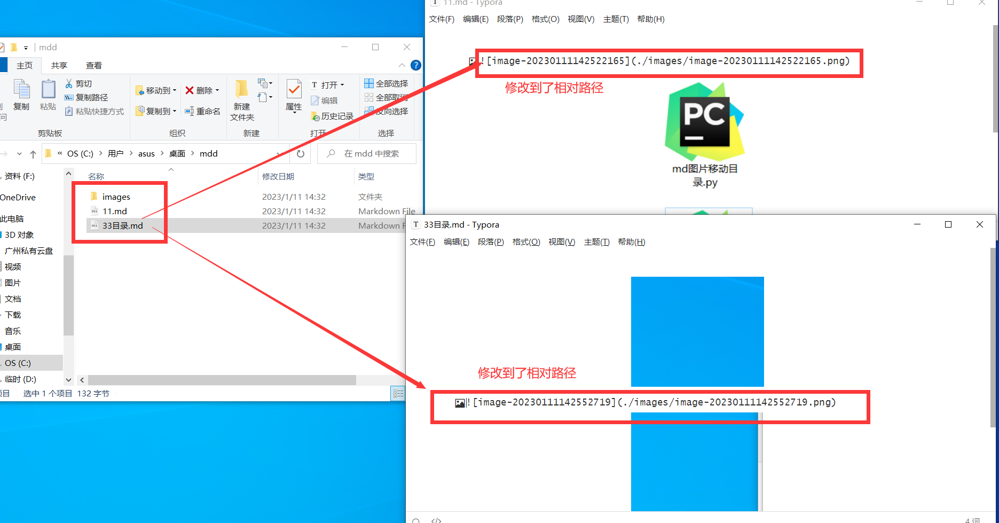
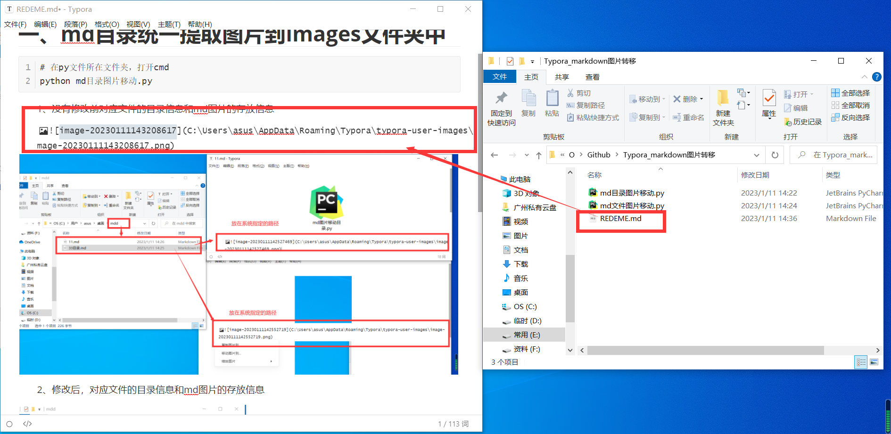

# 一、md目录统一提取图片到images文件夹中

```she
# 在py文件所在文件夹，打开cmd
python md目录图片移动.py
```

**1、没有修改前对应文件的目录信息和md图片的存放信息**


**2、修改后，对应文件的目录信息和md图片的存放信息**




# 二、md单个文件提取图片到images文件夹中

```she
# 在py文件所在文件夹，打开cmd
python md文件图片移动.py
```

**1、没有修改前对应文件的目录信息和md图片的存放信息**



**2、修改后，对应文件的目录信息和md图片的存放信息**

